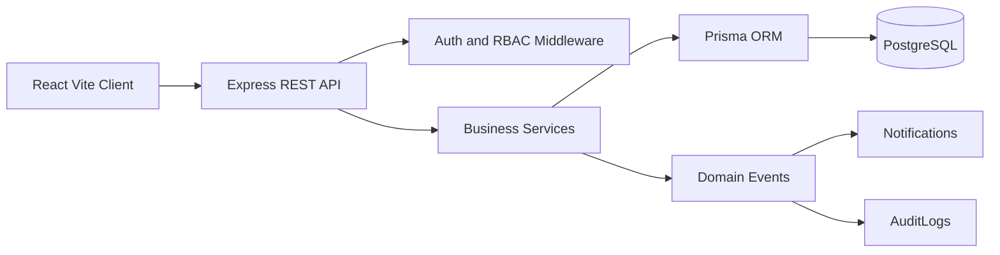

# Architecture

The API is split by module: auth, employees, attendance, leaves, payroll, documents, notifications, analytics, reports, audit logs, settings, and search. Multi-step workflows use transactions and emit domain events for notifications and audit entries.
