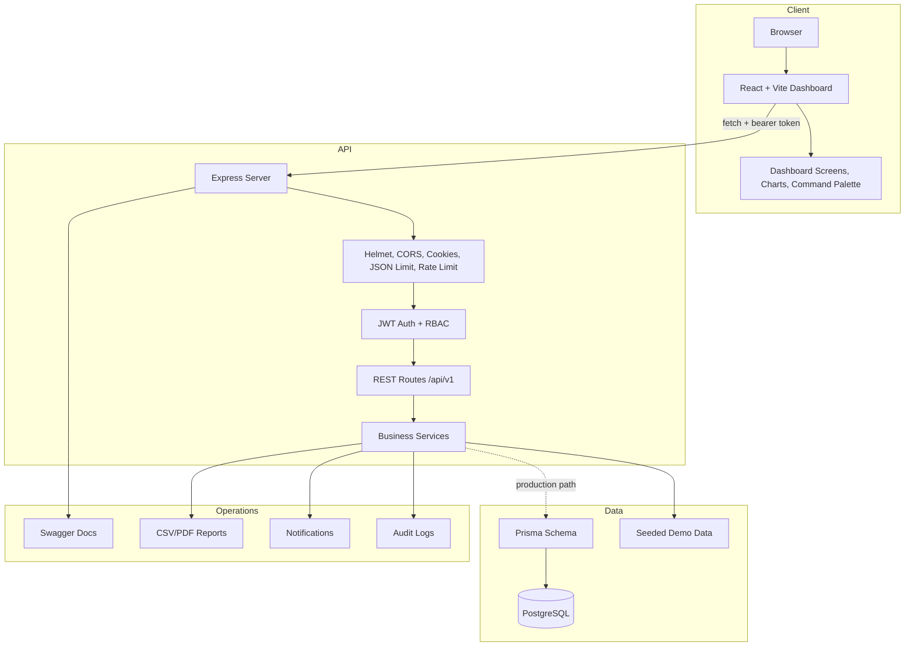
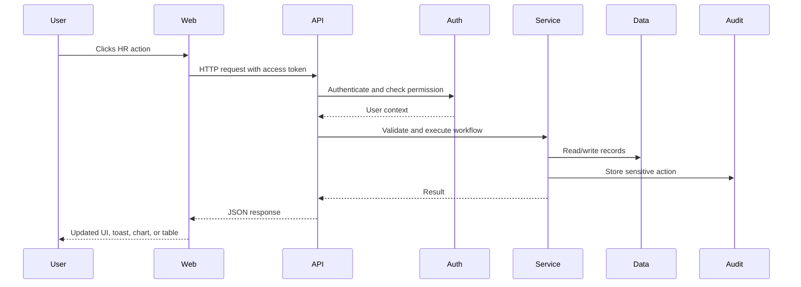
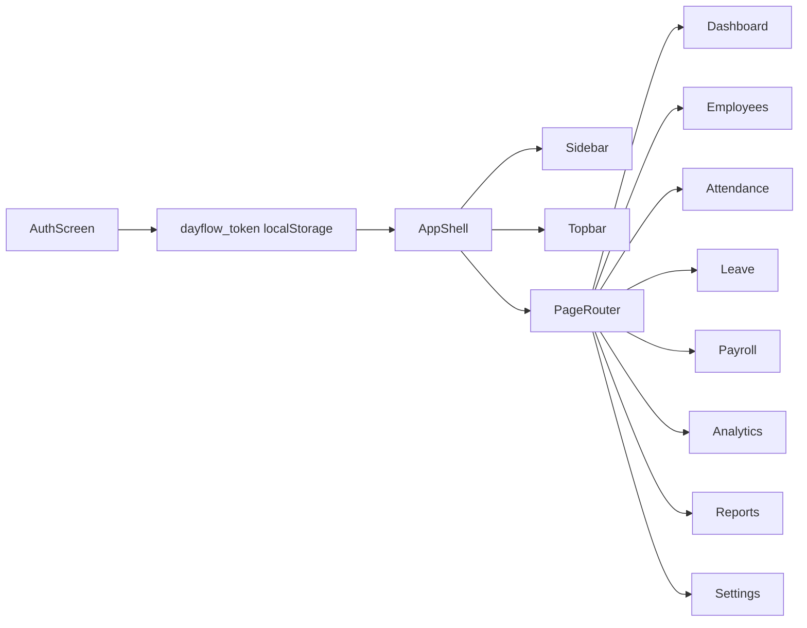
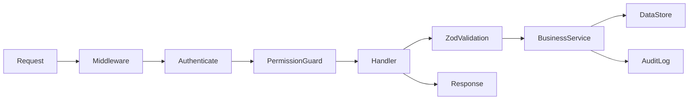

# Architecture

Dayflow uses a layered web architecture: a React dashboard talks to an Express API, the API applies security and validation, business modules perform HR workflows, and persistence can move from seeded demo data to PostgreSQL through Prisma.

## System Diagram



## Request Lifecycle



## Code Organization

```text
apps/api/src/server.ts
  Express app, middleware, route registration, API handlers.

apps/api/src/security.ts
  JWT signing, authentication middleware, RBAC permission guards.

apps/api/src/business.ts
  Attendance, leave, salary, analytics, dashboards, audit helpers.

apps/api/src/data.ts
  Demo data, roles, permissions, seeded employees, payroll, documents.

apps/api/prisma/schema.prisma
  Production relational model for PostgreSQL.

apps/web/src/main.tsx
  React routes, screens, API calls, charts, command palette, forms.

apps/web/src/styles.css
  Theme tokens, responsive layout, advanced background, interactions.
```

## Frontend Flow



## Backend Flow



## Security Boundaries

- Public routes: signup, login, forgot password, reset password, health.
- Authenticated routes: profile, dashboards, attendance, leave, payroll, documents, notifications.
- Admin-only routes: employee management, analytics, reports, audit logs, organization settings.
- Self-service routes: employee users can access only their own profile, attendance, leave, payroll, documents, and notifications.

## Production Upgrade Path

1. Replace demo data calls in `apps/api/src/data.ts` with Prisma client queries.
2. Apply `apps/api/prisma/schema.prisma` migrations to PostgreSQL.
3. Move document metadata to the database and binaries to object storage.
4. Add server-side pagination, filtering, and search indexes.
5. Expand Swagger definitions from route list to full OpenAPI schemas.
