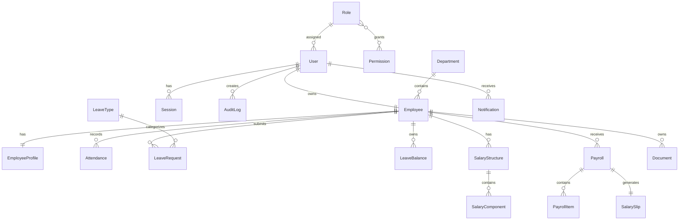

# ER Diagram

```mermaid
erDiagram
  User ||--|| Employee : owns
  User ||--o{ Session : has
  User ||--o{ AuditLog : creates
  Role ||--o{ User : assigned
  Role }o--o{ Permission : grants
  Department ||--o{ Employee : contains
  Employee ||--|| EmployeeProfile : has
  Employee ||--o{ Attendance : records
  Employee ||--o{ LeaveRequest : submits
  LeaveType ||--o{ LeaveRequest : categorizes
  Employee ||--o{ LeaveBalance : owns
  Employee ||--o{ SalaryStructure : has
  SalaryStructure ||--o{ SalaryComponent : contains
  Employee ||--o{ Payroll : receives
  Payroll ||--o{ PayrollItem : contains
  Payroll ||--|| SalarySlip : generates
  Employee ||--o{ Document : owns
  User ||--o{ Notification : receives
```
