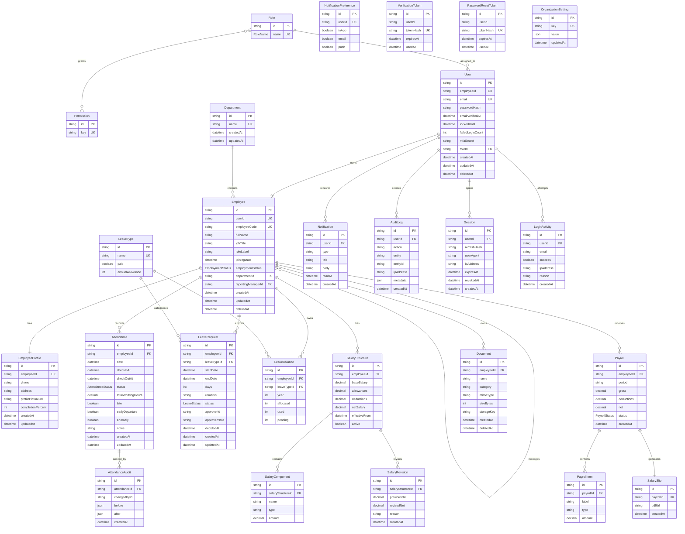

# ER Diagram

This diagram follows the production-oriented Prisma model in `apps/api/prisma/schema.prisma`.

## Full Entity Relationship Diagram



## Relationship Notes

| Relationship | Type | Purpose |
|---|---|---|
| `Role -> User` | One-to-many | A user receives one system role. |
| `Role <-> Permission` | Many-to-many | Roles grant route-level capabilities. |
| `User -> Employee` | One-to-one | Login identity connects to HR profile. |
| `Department -> Employee` | One-to-many | Employees are grouped by department. |
| `Employee -> Employee` | Self relation | Reporting manager hierarchy. |
| `Employee -> Attendance` | One-to-many | One attendance record per employee/date. |
| `Attendance -> AttendanceAudit` | One-to-many | HR corrections preserve before/after state. |
| `Employee -> LeaveRequest` | One-to-many | Employees submit leave requests. |
| `LeaveType -> LeaveRequest` | One-to-many | Requests are categorized by leave policy. |
| `Employee -> LeaveBalance` | One-to-many | Balances are tracked per leave type and year. |
| `Employee -> SalaryStructure` | One-to-many | Salary history and revisions. |
| `Employee -> Payroll` | One-to-many | Payroll records per period. |
| `Payroll -> SalarySlip` | One-to-one | Generated slip for a payroll period. |
| `Employee -> Document` | One-to-many | Employee document metadata and storage keys. |
| `User -> AuditLog` | One-to-many | Security-sensitive actions are traceable. |

## Important Constraints

```prisma
model Attendance {
  employeeId String
  date       DateTime

  @@unique([employeeId, date])
  @@index([date, status])
}
```

```prisma
model LeaveBalance {
  employeeId  String
  leaveTypeId String
  year        Int

  @@unique([employeeId, leaveTypeId, year])
}
```

```prisma
model Payroll {
  employeeId String
  period     String

  @@unique([employeeId, period])
}
```
