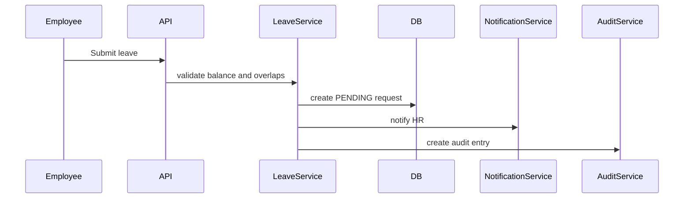
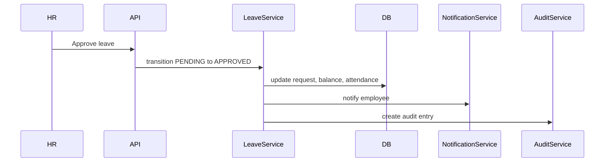

# Workflows

## Leave Submission

```mermaid
sequenceDiagram
  Employee->>API: Submit leave
  API->>LeaveService: validate balance and overlaps
  LeaveService->>DB: create PENDING request
  LeaveService->>NotificationService: notify HR
  LeaveService->>AuditService: create audit entry
```

## Leave Approval

```mermaid
sequenceDiagram
  HR->>API: Approve leave
  API->>LeaveService: transition PENDING to APPROVED
  LeaveService->>DB: update request, balance, attendance
  LeaveService->>NotificationService: notify employee
  LeaveService->>AuditService: create audit entry
```
