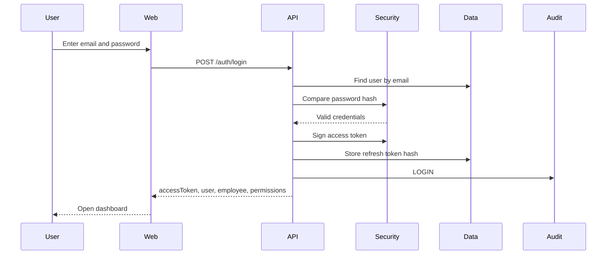
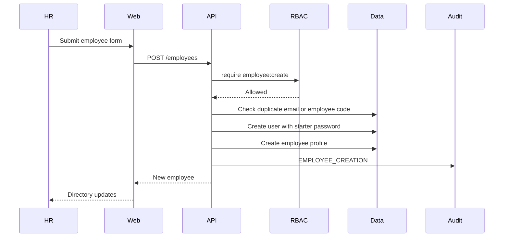
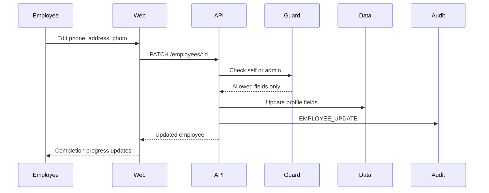
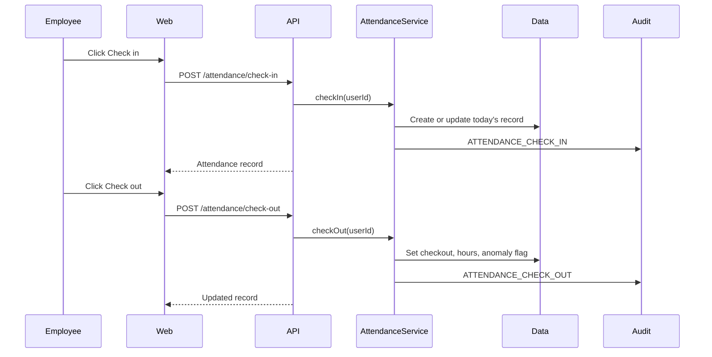
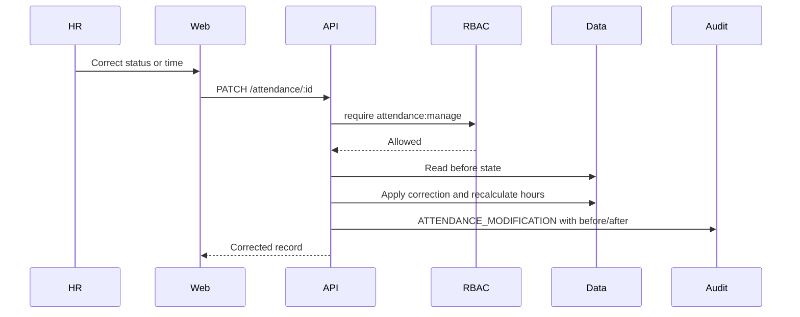
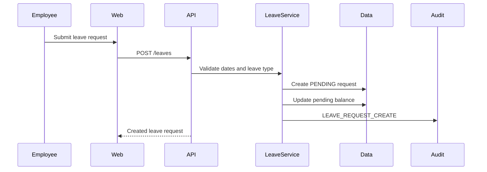
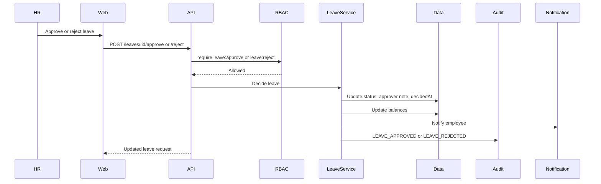
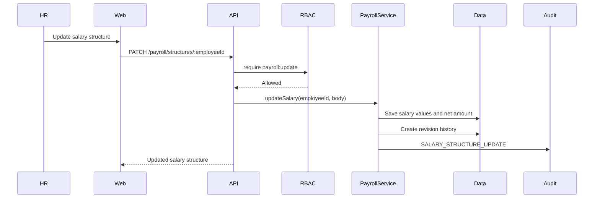
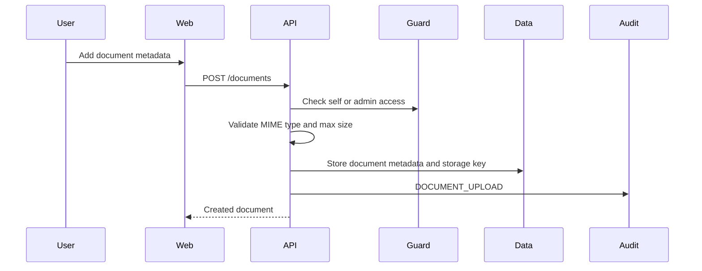
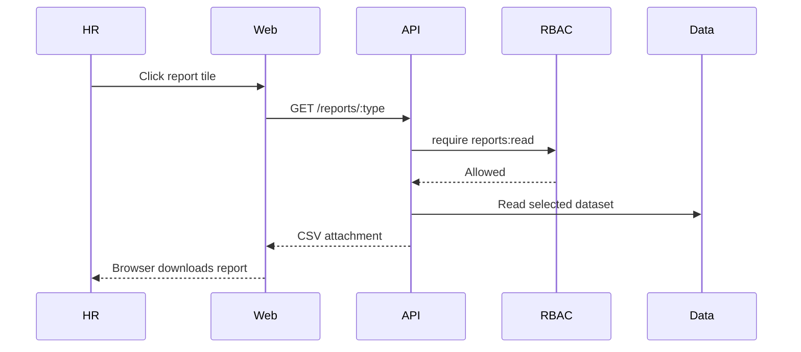

# Workflow Diagrams

This file documents the main HR workflows implemented by the Dayflow API and dashboard.

## Authentication

## Employee Onboarding

## Profile Update

## Attendance Check-In and Check-Out

## HR Attendance Correction

## Leave Submission

## Leave Approval

## Salary Structure Update

## Document Upload Metadata

## Reports

